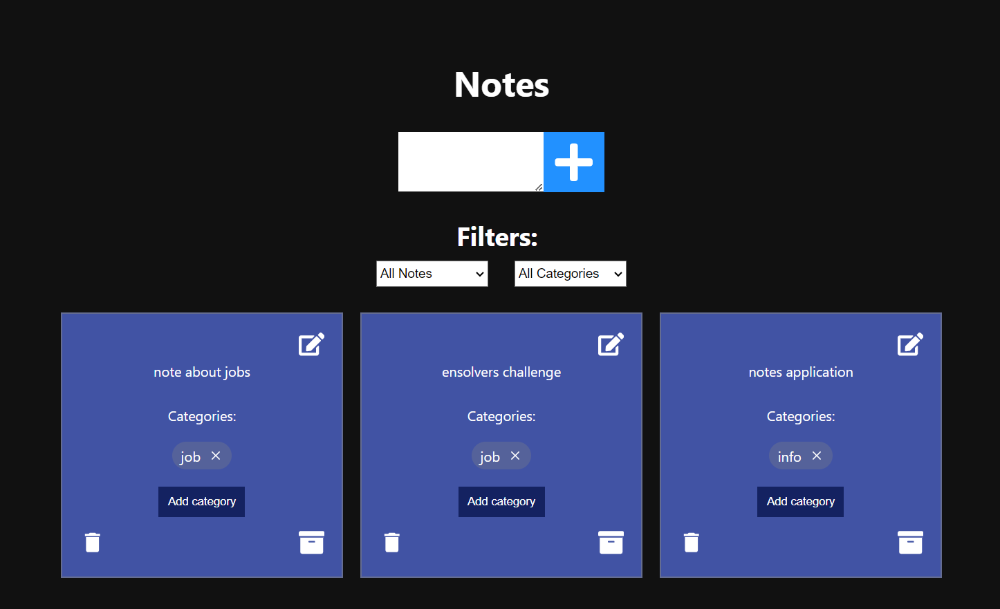

# Notes App

This is a simple Notes app developed using React for the frontend and Node.js with Express and Sequelize for the backend.

## Prerequisites

Make sure you have the following software installed on your machine before running the app:

- [Node.js](https://nodejs.org/) (v18.13.0 or later)
- [npm](https://www.npmjs.com/) (v8.19.3 or later)
- [PostgreSQL](https://www.postgresql.org/) (v12.0 or later)

## Installation

Clone the repository from:
https://github.com/ensolvers-github-challenges/Lopez-55b2cb

Navigate to the project directory:
cd Lopez-55b2cb

Configure database conection with your postgres creddentials in backend/config/config.json:
"development": {
"username": "your_username",
"password": "your_parrword",
"database": "ensolvers_notes",
"host": "localhost",
"dialect": "postgres",
"migrationStorage": "sequelize",
"migrationStorageTableName": "SequelizeMeta"
},

Run the setup script:
./setup.sh
